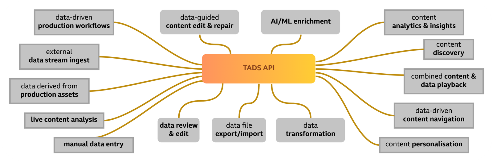
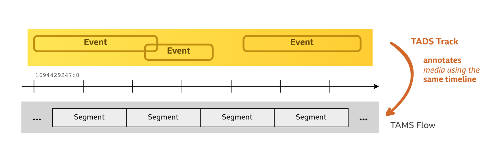
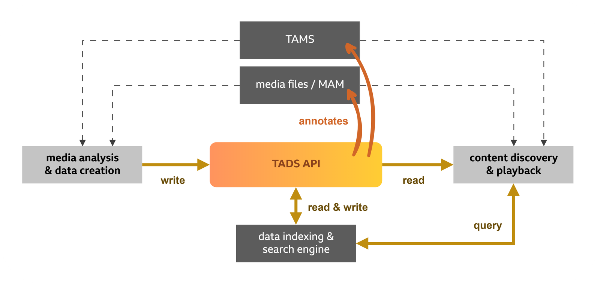

# Time-Addressable Data Store API

From the team who brought you [TAMS (Time-Addressable Media Store)](https://tams.org/), TADS: The Time-Addressable Data Store is designed to be open, interoperable, and cloud-native.

> [!CAUTION]
> TADS is still early in development and should be considered in an Alpha phase.
> It should not be used in production and core aspect will change frequently in the short term.
> We welcome feedback and contributions to help move this spec towards maturity, and to ensure its suitability across a broad range of use cases.

## Documentation

- [OpenAPI Specification](./api/TimeAddressableDataStore.yaml)
- [Rendered Specification](https://bbc.github.io/tads)
- [Supporting Documentation (Application notes and Decision Records)](./docs/README.md)

## TADS is for timeline data

Modern media workflows benefit from a rapidly increasing assortment of data about content, whether manually or machine generated: logging, transcripts, shot-changes and person identification to name but a few, all linked to the content timeline.

This data is essential to production processes: helping creative teams find the best content and tell the most engaging stories, while making their workflows smarter and more efficient.
And increasingly, data drives personalised audience-facing experiences such as [Chapters & Key Moments](https://www.bbc.co.uk/iplayer/help/questions/features/chapters-moments) on BBC iPlayer or BBC R&D's [SIGNALS interactivity layer](https://www.bbc.co.uk/rd/articles/2026-05-signals-interactive-live-tv-engagement).

However, the ecosystem supporting this data is fragmented.
The challenge of integrating disparate systems results in content being transcribed for every team that accesses it, a break in content history whenever an edited programme is rendered, and valuable insights lost or limited in scope.

TADS is designed to:

- nurture an open ecosystem for timeline data by providing a common integration point
- do for data what TAMS has done for media, by building on similar principles
- support timeline data for all content whether in archive systems, file-based MAMs, or TAMS

## Working with the industry

We want to work with the industry early and often to develop a solution for timeline data storage, continuing the open and interoperable approach of the TAMS ecosystem.

As an alpha specification, TADS is still in the “research” phase.
As such, we intend to maintain this specification (and any associated resources) as BBC R&D for the near term.
But we anticipate that our ability to draw on many years of TAMS development, and a shared need for this technology in the industry, will allow us to move rapidly towards a stable core specification.
Once we and the community deem it appropriate, we’ll revisit the ownership of the TADS specification and explore options for host organisations.

## How TADS works

TADS allows you to [create Tracks](https://bbc.github.io/tads/0.1/index.html#/operations/PUT_tracks-track_id) and [store data Events](https://bbc.github.io/tads/0.1/index.html#/operations/POST_tracks-track_id-events) on them.
Each Track shares a timeline with a media item in another system, such as TAMS or a file system.

Event payloads are formatted as JSON.
Each Track is associated with a managed [Payload Schema](https://bbc.github.io/tads/0.1/index.html#/operations/PUT_schemas-schema_id), that uses [JSON Schema](https://json-schema.org/).
Each new Event is validated against this Payload Schema.
Many common data workflows require Events that overlap on the timeline (e.g. tracking visibility of actors in a video) and the editing of Events (e.g. progressive improvements to transcripts).
TADS supports both.

The TADS API provides similar mechanisms to TAMS for managing items in the store and receiving updates via [Webhooks](https://bbc.github.io/tads/0.1/index.html#/operations/POST_service-webhooks).

## Why not use TAMS for data?

The current rapid deployment of TAMS at scale in multiple businesses has resulted in a significant interest in the question of where to store data that isn’t suitable for storage in TAMS.

When we first open-sourced TAMS, we made [recommendations on when it is and isn’t appropriate to store data in TAMS](https://github.com/bbc/tams/blob/main/docs/appnotes/0004-tams-for-data.md).
The primary driving factors being the size of the data and the access patterns.
It doesn’t make sense to store data which is significantly smaller than the metadata TAMS stores about it.
The indirect access of Media Objects via URLs is inefficient for many forms of data.
And the inability to search by the data itself limits the applicable use cases.

TADS aims to solve these issues by better supporting the storing of data in a database rather than object storage.
It returns data directly in Events listings.
And it better supports search index systems.

While the data models of TADS and [TAMS](https://github.com/bbc/tams/blob/main/docs/appnotes/0001-multi-mono-essence-flows-sources.md) contain some similar concepts, the requirement in TADS for the editing and overlapping of Events breaks important TAMS principles: immutability, and the use of a timerange to uniquely refer to a specific sequence of content.

## Building an ecosystem

Using common, open foundations offers agility in media supply chains.
It enables organisations (such as the BBC) to make best use of new capabilities to meet the demands of their audiences, while retaining control of their data, and enables systems that generate metadata to integrate more widely with workflows.

TADS is an API specification for reading, writing and editing timeline data in a store.
We expect it to be [used alongside TAMS](https://github.com/bbc/tads/blob/main/docs/appnotes/0001-using-tads-with-tams.md) and other systems.
How will all of these systems fit together, and what is missing from the current alpha release of TADS?

### Searching by data

Our working assumption is that indexing and search systems are separable from the TADS API, allowing the unique requirements of each data type to be met.
However, it’s important that they work effectively together.

- Are architecture recommendations needed for connecting the TADS API and indexing/search systems?
- Should any data query facilities be made available directly through the TADS API?

### Integrating with other schema stores

A Payload Schemas solution is included in the initial release of TADS but we’re aware that mature business workflows may have their own schema management.

- Should the built-in Payload Schemas solution be an optional part of TADS?
- When schemas are stored in an external system, what’s the best approach to harmonising Track and schema lifecycles and ensuring TADS reliability?

### Describing rich relationships between Tracks and with content

Many workflows need to capture complex relationships, for example to relate data to content, to group data Tracks to be used together (like with Sources and multi-essence collections in TAMS), or to capture ancestry.

- Is it best to include these relationships in TADS?
- Should the mechanism be generic or tailored to specific use cases?

### Integrating with data-driven workflows

TADS has the potential to enable interoperable, data-driven workflows.
Expressing the “data contracts” between workflow processes using TADS will be important.

- Which topics should be within scope of TADS?
Perhaps characteristics of Events (overlaps, gaps), nature of the data (purpose, audience, status), or its management (provenance, editing controls, versioning).
- Are built-in Track properties the best approach, or will the requirements be use case specific?

### Using TADS alongside TAMS

TADS is well-suited to managing data that annotates media held in TAMS.
We have provided initial recommendations for such integrations in [TADS AppNote 0001](https://github.com/bbc/tads/blob/main/docs/appnotes/0001-using-tads-with-tams.md).
But further recommendations are required for more advanced use cases.

- How are the authorisation of media and data tied together?
- How is TADS data used with TAMS edit-by-reference workflows?

## API Versioning

> [!CAUTION]
> While TADS is in an alpha phase, the major version number shall remain `0`.
> Breaking changes may be made during this alpha phase without incrementing the major version number.

The API is versioned using a major and minor version number.
A breaking change - such as removal of a feature, or renaming of properties in such a way that would break compatibility (including fixing a typo) - results in a major version increment and the minor version is reset to 0.
Features such new endpoints or new (optional) data properties result in a minor version increment.
Other changes such as documentation changes do not result in version updates.
Note that the version may change frequently whilst the API is still under development!

Versions are calculated automatically upon release using 'magic' strings included in commit messages:

- `sem-ver: api-break` - where a breaking change is made (results in a major version bump)
- `sem-ver: feature` - where a new feature has been added (results in a minor version bump)
- `sem-ver: deprecation` - where an existing feature has been marked as deprecated, but not yet removed (results in a minor version bump)

Commits without one of these magic strings are assumed to be unsubstantial and will not result in a version bump.
Versions will only be incremented once when a release is made.
If there are multiple commits since the last release, the major version number will be incremented by 1, and minor version set to 0 if at least one of the commits contains an `api-break`.
If there are no `api-break` changes since the last release, the minor version will be incremented by 1 if at least one commit contains a `feature` or `deprecation` change.
Otherwise, the version will not change.

It is possible to see what the version would be if a release was made at the current commit by running `make next-version` in the top directory of this repository.

## Security

The TADS specification stipulates authentication methods that a client should support in order to identify themselves and provide credentials to the server, using standard HTTP approaches.
The authorisation model (the rules by which authenticated requests are allowed or denied) is not part of the TADS specification, and is up to individual implementers and organisations depending on their exact rules, needs and threat model.

It is assumed that implementations will apply other IT and cloud infrastructure security best practices, notably including the use of TLS (e.g. HTTPS connections) within and between their systems.

## Proposals, Decisions and Architecture Changes

This repository uses [(M)ADR documents](https://adr.github.io/madr/) to propose significant changes, facilitate discussions and decision making, and to store a record of options that were considered.
These documents may be found in the [docs/adr](./docs/adr/) directory, and are managed as described by the [ADR Readme](./docs/adr/README.md).

## Development

This repository contains a [Makefile](./Makefile) with various targets to aid specification development.
These rely on having Docker available on the system, are primarily tested on Linux and some of the images used are only built for x86-64 platforms, however other operating systems and platforms may work using emulation.
Linting and documentation rendering are also handled by GitHub Actions when Pull Requests are submitted and merged.

The following targets are available:

- `make lint` - Lint Markdown documents, validate API specifications, examples and schemas
- `make render` - Generate HTML rendered version of OpenAPI spec (at `api/docs/index.html`)
- `make mock-server-up` - Start a mock TADS API on <http://localhost:4010/?access_token=fake>

Note that for the mock server, some credentials must be supplied to meet the spec; either an `Authorization` header for HTTP Basic/Bearer token, or an `access_token` query string.

## Making a release

Run the `release` workflow under the `Actions` tab on this repository on GitHub against the `main` branch.
This workflow requires approval.
This workflow will fail if it does not identify any commits that would result in a version bump (see [API Versioning](#api-versioning)).

## Get in touch

TADS is an alpha specification and will change rapidly in the short term.
We are keen to work with the TAMS community and other interested parties to iterate on this first draft, addressing the list of questions above and more.
If you’d like to be a part of this we’d love to hear from you!
Please contact us via the [#tads channel](https://tams-media.slack.com/archives/C0C05776SHJ) on the TAMS Slack space, via email at <cloudfit-opensource@rd.bbc.co.uk>, or raise an [issue](https://github.com/bbc/tads/issues) on this repository.
Also see [CONTRIBUTING.md](./CONTRIBUTING.md) for more about how to make contributions.
