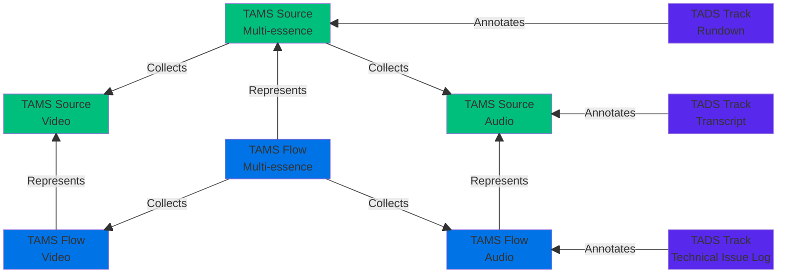
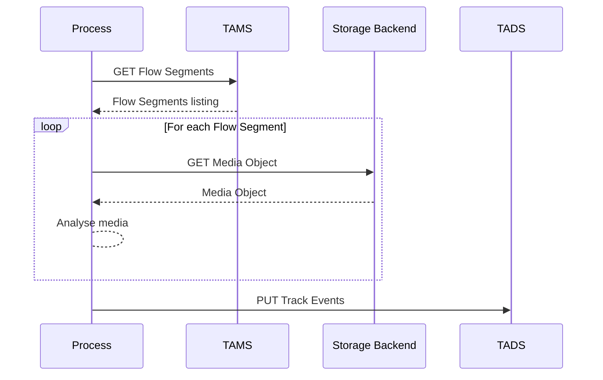
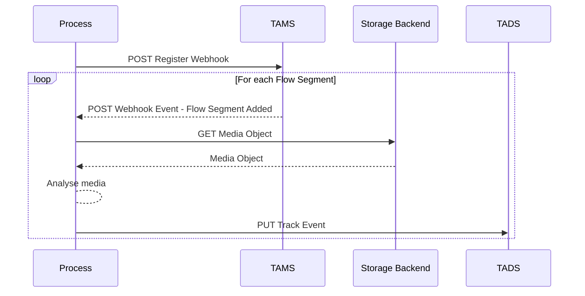
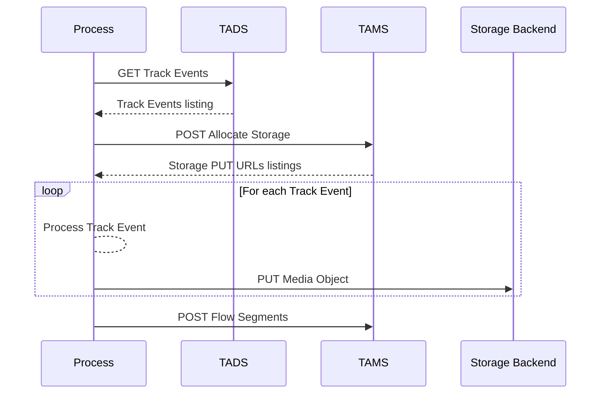
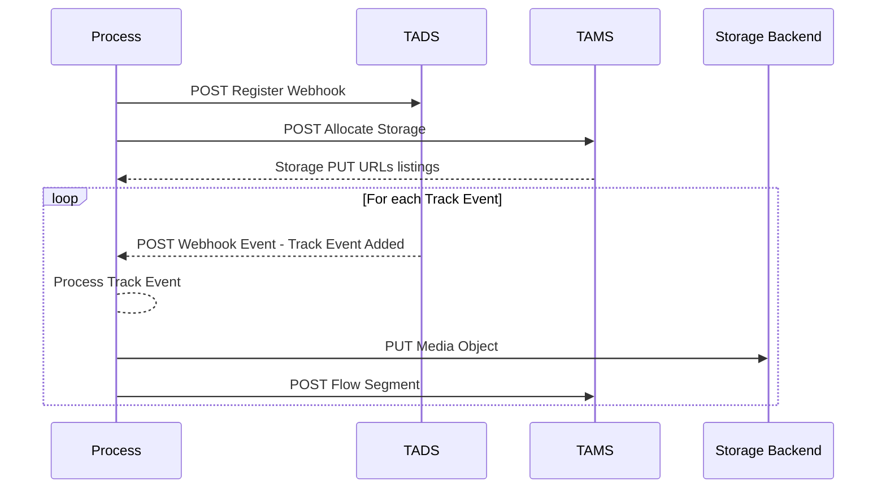
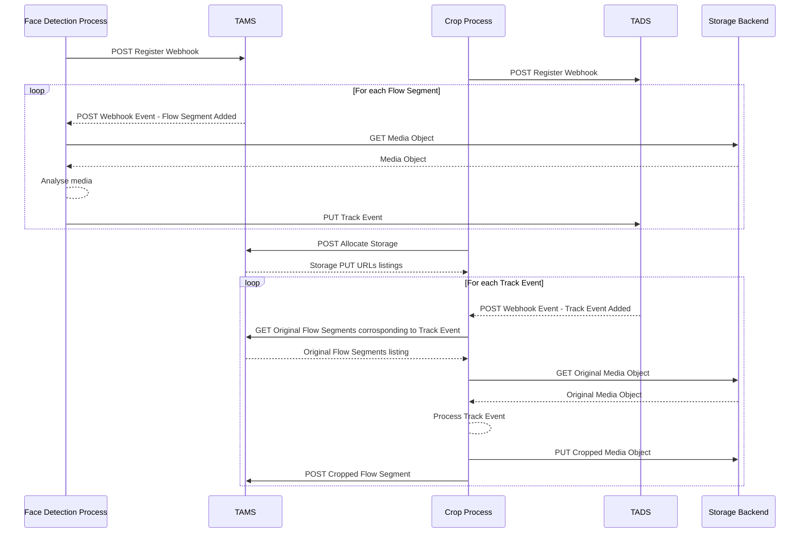

# 0001: Using TADS with TAMS

[TAMS](https://tams.org/) is the Time-Addressable Media Store API specification.
It can be used to store, query and randomly access segmented media in a sample-accurate manner.
Like TADS it is designed to be interoperable, cloud-native, and suitable for fast turnaround workflows.

This application note describes how TAMS may be used alongside TADS.
Prior knowledge of TAMS and its data model is assumed.

## Timing and Identity

Both TADS and TAMS use nanosecond resolution timestamps and [timeranges](https://bbc.github.io/tads/0.1/index.html#/schemas/timerange) to refer to timelines.
Related content in TADS and TAMS should use a shared timeline.
For the case where data in TADS annotates media in TAMS, the [TADS Track](https://bbc.github.io/tads/0.1/index.html#/operations/GET_tracks-track_id) uses the same timeline as the referenced media in TAMS.
This is indicated using the `timeline_reference.entity_id` attribute of the Track, and setting it to a URI reference of a suitable TAMS Source or Flow, in accordance with the [TAMS AppNote 0014](https://github.com/bbc/tams/blob/main/docs/appnotes/0014-referencing-tams-content-in-other-systems.md#uri-references).
URIs MUST use the TAMS "pseudo-protocol" URI variant.
i.e. use `tams://` in place of `https://`.
Note that the TAMS service should still be accessible by replacing `tams://` with `https://` in any request.
The [TAMS AppNote 0014](https://github.com/bbc/tams/blob/main/docs/appnotes/0014-referencing-tams-content-in-other-systems.md) URI variants referring to specific TimeRanges of Sources or Flows MUST NOT be used.
As [TAMS Sources/Flows](https://github.com/bbc/tams/blob/main/docs/appnotes/0001-multi-mono-essence-flows-sources.md) each use a single unambiguous timeline, `timeline_reference.timeline_selected` shouldn't be populated.

While the TADS Track's timeline is shared with a TAMS Source/Flow, its Track Events may cover different TimeRanges to the Flow's Segments.
Consider a transcription that uses a Track Event per sentence.
A Flow Segment may contain multiple sentences.
And a sentence may overlap multiple Flow Segments.

When choosing which Source or Flow in TAMS to reference, Implementations should consider the applicability of the data they are storing.
Referencing TAMS Sources should be preferred to Flows.
This allows for the Clients to easily utilise TADS Tracks alongside the multiple Flows of a Source.
Likewise, referencing the top level Multi-Source should be preferred where the data annotates an entire multi-media package.
Referencing individual TAMS Flows may be appropriate in cases where data is only applicable to a single technical representation.
For example, logging of technical glitches in a given representation.



The following is an example of Track metadata for a transcript.
`adb87970-b03a-4266-b5d8-f3f6541fb73a` in `schema_id` is the ID of the transcript [Payload Schema](https://bbc.github.io/tads/0.1/index.html#/operations/GET_schemas-schema_id) available in this TADS Service Instance.
`8d7227aa-6bf2-4e84-881c-89eb046c3b48` is the Source ID of the related Audio Source available in a TAMS service, signalled via `tams://`, at the URL `https://tams.example.com/`.

```json
{
  "id": "20992138-abdb-4daf-84f3-a0e07dabb5ca",
  "label": "Example Transcript",
  "description": "This is an example of a transcript track",
  "created": "2008-05-27T18:51:00Z",
  "metadata_updated": "2023-09-14T09:45:26Z",
  "events_updated": "2023-09-14T09:45:26Z",
  "created_by": "tads-dev",
  "updated_by": "tads-dev",
  "schema_id": "adb87970-b03a-4266-b5d8-f3f6541fb73a",
  "timeline_reference": {
    "entity_id": "tams://tams.example.com/sources/8d7227aa-6bf2-4e84-881c-89eb046c3b48"
  }
}
```

## Discovery

### Finding TADS Tracks from TAMS Source/Flow IDs

TADS Tracks may be filtered by their `timeline_reference.entity_id` using the `timeline_reference.entity_id` query parameter on the [`GET /tracks` method](https://bbc.github.io/tads/0.1/index.html#/operations/GET_tracks), which accepts a comma-seperated list of percent-encoded URIs.

The following request may be used to locate the example Track above, and any others with the same `timeline_reference.entity_id`.
Note that the Entity ID has been percent-encoded twice.

`GET https://tads.example.com/tracks?timeline_reference.entity_id=tams%253A%252F%252Ftams.example.com%252Fsources%252F8d7227aa-6bf2-4e84-881c-89eb046c3b48`

The above request may return additional Tracks that aren't of interest.
For example, the titles of songs being played at various points on the timeline.
Further filters, such as `schema_id` may be used to find the specific data you want.

`GET https://tads.example.com/tracks?timeline_reference.entity_id=tams%253A%252F%252Ftams.example.com%252Fsources%252F8d7227aa-6bf2-4e84-881c-89eb046c3b48&schema_id=adb87970-b03a-4266-b5d8-f3f6541fb73a`

Where the Client is unsure of the TAMS resource the Track of interest references, multiple entries may be provided in `timeline_reference.entity_id` and Tracks matching any of the provided identifiers will be returned.

For the Audio Source above, the following may be identified:

* The Multi-Source which collected the Audio Source may be found in the `collected_by` attribute in the Audio Source's metadata in TAMS
  * e.g. A Multi-Source ID of `8ea76a60-7942-4c01-accd-3e94974197c8`
* The Flow IDs representing the Audio Source may be found by the following request `GET https://tams.example.com/flows?source_id=8d7227aa-6bf2-4e84-881c-89eb046c3b48`
  * e.g. An AAC Flow with ID `4d0a3aa1-b76a-458f-92cb-1b6b98ad18e2`, and a WAV Flow with ID `42bc1a4c-9b2f-4387-8336-e15dc570f57c`

Our original Source and these 3 additional resources may be queried, along with a Payload Schema filter as follows:

`GET https://tads.example.com/tracks?timeline_reference.entity_id=tams%253A%252F%252Ftams.example.com%252Fsources%252F8d7227aa-6bf2-4e84-881c-89eb046c3b48%2Ctams%253A%252F%252Ftams.example.com%252Fsources%252F8ea76a60-7942-4c01-accd-3e94974197c8%2Ctams%253A%252F%252Ftams.example.com%252Fflows%252F4d0a3aa1-b76a-458f-92cb-1b6b98ad18e2%2Ctams%253A%252F%252Ftams.example.com%252Fflows%252F42bc1a4c-9b2f-4387-8336-e15dc570f57c&schema_id=adb87970-b03a-4266-b5d8-f3f6541fb73a`

> [!IMPORTANT]
> Notice that the `timeline_reference.entity_id` values here have gone through two percent-encoding processes.
> The first to encode each URI individually, ensuring any commas do not interfere with those used to seperate each URI in the list.
> The second to encode the entire parameter list string.
> The latter encode/decode will normally be carried out by HTTP libraries for you.

Assuming our example Track above is the only match, all three of these queries would return the following:

```json
[
    {
        "id": "20992138-abdb-4daf-84f3-a0e07dabb5ca",
        "label": "Example Transcript",
        "description": "This is an example of a transcript track",
        "created": "2008-05-27T18:51:00Z",
        "metadata_updated": "2023-09-14T09:45:26Z",
        "events_updated": "2023-09-14T09:45:26Z",
        "created_by": "tads-dev",
        "updated_by": "tads-dev",
        "schema_id": "adb87970-b03a-4266-b5d8-f3f6541fb73a",
        "timeline_reference": {
            "entity_id": "tams://tams.example.com/sources/8d7227aa-6bf2-4e84-881c-89eb046c3b48"
        }
    }
]
```

### Finding TAMS Source/Flow IDs from TADS Tracks

TADS Tracks associated with TAMS content will include a [TAMS AppNote 0014](https://github.com/bbc/tams/blob/main/docs/appnotes/0014-referencing-tams-content-in-other-systems.md) compatible URI in their `timeline_reference.entity_id` attribute.
The use of TAMS for the [`timeline_reference.entity_id`](https://bbc.github.io/tads/0.1/index.html#/operations/GET_tracks) may be identified by the use of the `tams://` "pseudo-protocol" at the start of the URI.
Where the Timeline Reference Entity ID is a TAMS Source or Flow ID, the `tams://` pseudo-protocal may be replaced with `https://` to produce a valid URL referencing a TAMS Service Instance.
Performing a GET request against it will return the Source/Flow metadata, with other TAMS endpoints such as [`flows/<flow_id>/segments`](https://bbc.github.io/tams/8.2/index.html#/operations/GET_flows-flowId-segments) being available on the same host.

## Potential Architectures

### Batch Analysis of TAMS Media

Where a process is to analyse a [TAMS Flow](https://bbc.github.io/tams/8.2/index.html#/operations/GET_flows-flowId) whose `status` is `closed_complete`, this may be performed purely via the REST API.
The process shall retrieve and analyse every Segment in the TAMS Flow.
The timing information for resultant Track Events should be derived from the [Segment metadata](https://bbc.github.io/tams/8.2/index.html#/operations/GET_flows-flowId-segments).
Resulting analysis data may then be written as a list of [Track Events](https://bbc.github.io/tads/0.1/index.html#/operations/POST_tracks-track_id-events) to TADS.



### Event-driven Analysis of TAMS Media

Where the Flow to be analysed is still being ingested, it may be more appropriate for the analysis process to register a webhook to recieve [`flows/segments_added` webhook events](https://bbc.github.io/tams/8.2/index.html#/webhooks/flows-segments_added/post) from TAMS as new Flow Segments become available.
As each Segment notification is received, its Media Object will be retrieved via one of the included `get_urls` and the media analysed.
The timing information for resultant [Track Events](https://bbc.github.io/tads/0.1/index.html#/operations/POST_tracks-track_id-events) should be derived from the Segment metadata.
The resulting Track Event(s) shall then be written to TADS.



### Writeback to TAMS

The reverse is also possible.
Data-driven workflows, where media is generated/modified based on Events in TADS, may write media to TAMS.
Again, this may be a batch process using the TADS REST API, or it may be event-driven using the [TADS Webhooks](https://bbc.github.io/tads/0.1/index.html#/operations/POST_service-webhooks) capability.



> [!NOTE]
> Implementations of the following must handle paging of the Storage PUT URLs response



### More complex use cases

The concepts above may be combined to produce more complex data-driven workflow.

In the example below, video is ingested live into TAMS.
The [`flows/segments_added` webhook events](https://bbc.github.io/tams/8.2/index.html#/webhooks/flows-segments_added/post) for this Flow are used to trigger a face detection algorithm.
The results of this are written to a Track in TADS.
The [`tracks/events_added` webhook events](https://bbc.github.io/tads/0.1/index.html#/webhooks/tracks-events_added/post) for this Track are then used alongside the original Flow to produce cropped video of the faces present.
That cropped video is then [written back to TAMS](https://bbc.github.io/tams/8.2/index.html#/operations/POST_flows-flowId-segments).

> [!NOTE]
> Implementations of the following must handle paging of the Storage PUT URLs response



## Considerations

### Overlapping Track Events

While TADS Track Event TimeRanges may overlap, the same is not true of TAMS Segments.
[TADS Tracks](https://bbc.github.io/tads/0.1/index.html#/operations/GET_tracks-track_id) may explicitly indicate they do not contain overlapping Track Events by setting the [`allow_overlaps` attribute to `false`](https://bbc.github.io/tads/0.1/index.html#/operations/PUT_tracks-track_id-allow_overlaps).
Processes writing to TAMS may prefer or even require Tracks where `allow_overlaps` is set to `false`.

If such restrictions aren't possible, a system which generates TAMS Flow Segments from TADS Track Events may need to de-conflict TimeRanges.
This might not be possible for all types of data, and may require the shifting of TimeRange boundaries.
Systems may still need to handle edge cases where the state of the Track timeline changes between the fetching of pages of results.
As such, repeated runs of such a process may not output identical results.

A workflow may create a second "snapshot" Track that is a non-overlapping copy of a Track that allows overlaps to facilitate downstream workflows.
This would be performed by a sidecar-process which consumes the original Track and writes the non-overlapping version.
The de-conflict logic for such a process would be dependent on the data type.
A genericised solution likely isn't possible.

### Track Event Edits

While TADS permits editing of Track Events, the same is not true of TAMS Segments.
[TADS Tracks](https://bbc.github.io/tads/0.1/index.html#/operations/GET_tracks-track_id) may explicitly indicate they do not permit editing of Track Events by setting the [`editable_events` attribute to `false`](https://bbc.github.io/tads/0.1/index.html#/operations/PUT_tracks-track_id-editable_events).
Processes writing to TAMS may prefer or even require Tracks where `editable_events` is set to `false`.

If such restrictions aren't possible, a system which generates TAMS Flow Segments from TADS Track Events as part of a batch process may accept this and process Tracks as if they were a snapshot in time when the process ran.
Likewise, a webhook event-driven process may [subscribe](https://bbc.github.io/tads/0.1/index.html#/operations/PUT_service-webhooks-webhook_id) to [`tracks/events_added`](https://bbc.github.io/tads/0.1/index.html#/webhooks/tracks-events_added/post) but not [`tracks/events_updated`](https://bbc.github.io/tads/0.1/index.html#/webhooks/tracks-events_updated/post) or [`tracks/events_deleted`](https://bbc.github.io/tads/0.1/index.html#/webhooks/tracks-events_deleted/post).
Again, this would result in the process acting on Track Events as they were when first created.
Any Track Event updates would be ignored, which may result in divergance of the TADS Track and resultant TAMS Source.
As such, repeated runs of such a process may not output identical results.

A workflow may create a second "snapshot" Track that is a non-editable copy of an editable Track to facilitate downstream workflows.
This would be performed by a sidecar-process which consumes the original Track and writes the non-editable version.
Either using the same static export, or `tracks/events_added` webhook mechanisms described above.
Or using some other more advanced processing.

### TAMS Writeback Compatible Track Configuration

For the reasons stated above, workflows that use TADS data to generate media to be written to TAMS should prefer [Tracks](https://bbc.github.io/tads/0.1/index.html#/operations/GET_tracks-track_id) that are configured with both `allow_overlaps` and `editable_events` set to `False`.
With this configuration, a consuming Client would have the same expectations of Track Events on the TADS Track as Flow Segments in TAMS.
This includes the [following aspect of the TAMS specification](https://bbc.github.io/tams/8.2/index.html#/operations/POST_flows-flowId-segments):

> Clients MAY modify Flow Segments, but this should only be done in exceptional circumstances to correct metadata such as key_frame_count, as such operations will likely break the idempotency of Segments.
> If a client needs to modify a Flow Segment, then the client SHOULD first delete the existing Segment and then write a new one.
> The behaviour is undefined if the Segment exists and the service may return a 400 error response.

That is to say a writing client may delete and re-create Track Events, even if `editable_events` is set to `False`.
But this should only be done in exceptional circumstances.
i.e. to fix corrupted or otherwise broken data.

## Example workflow

The following is an example workflow for creating a transcript in TADS of an Audio Flow in TAMS, and retrieval of clips using that transcript.

1. A transcript worker [subscribes](https://bbc.github.io/tams/8.2/index.html#/operations/POST_webhooks) to the [`flows/created` Webhook Events](https://bbc.github.io/tams/8.2/index.html#/webhooks/flows-created/post) in TAMS with appropriate filters (e.g. tags) to identify Flows to be transcribed
2. When a Flow created Webhook Event is received, a [Track is created](https://bbc.github.io/tads/0.1/index.html#/operations/PUT_tracks-track_id) in TADS to write the transcript to
    1. The `schema_id` is set to the ID of an appropriate [Payload Schema](https://bbc.github.io/tads/0.1/index.html#/operations/GET_schemas)
    2. The `timeline_reference.entity_id` is set to the [TAMS AppNote 0014 compatible URI](https://github.com/bbc/tams/blob/main/docs/appnotes/0014-referencing-tams-content-in-other-systems.md#uri-references) of the Flow's Source
3. The worker [subscribes](https://bbc.github.io/tams/8.2/index.html#/operations/POST_webhooks) to the [`flows/segments_added` Webhook Events](https://bbc.github.io/tams/8.2/index.html#/webhooks/flows-segments_added/post) in TAMS with the `flow_ids` filter set to the ID of the Flow to be transcribed
4. As new Segment added Webhook Events are received, the worker fetches the Media Object in the Segment event and transcribes it
    1. For some processes, such as transcript, the worker may need to buffer Segments to account for sentences and contextual information which cover more than one Segment
5. The resulting transcript is then [written as Track Events](https://bbc.github.io/tads/0.1/index.html#/operations/POST_tracks-track_id-events) to the Track created earlier
    1. The [TimeRange](https://bbc.github.io/tads/0.1/index.html#/schemas/timerange) of each Track Event is time that transcript payload covers against the Flow's timeline
6. A user may then use a search Client to locate speech of interest
    1. Such a search Client may use a specialist Search Index to locate Track Events of interest
7. The Client should verify that the [`timeline_reference.entity_id`](https://bbc.github.io/tads/0.1/index.html#/operations/GET_tracks-track_id) URI is a TAMS URI (i.e. starts with `tams://`)
8. The Source ID in the Track's `timeline_reference.entity_id` is used to identify the most appopriate Flow for retrieval of the media
    1. This is done via [`GET https://tams.example.com/flows?source_id=<source_id>`](https://bbc.github.io/tams/8.2/index.html#/operations/GET_flows) with the corresponding Source ID
9. The TimeRange of the Track Events of interest is then used to retrieve the corresponding Flow Segments
    1. This is done via [`GET https://tams.example.com/flows/<flow_id>/segments?timerange=<timerange>`](https://bbc.github.io/tams/8.2/index.html#/operations/GET_flows-flowId-segments) with the corresponding Flow ID and TimeRange
